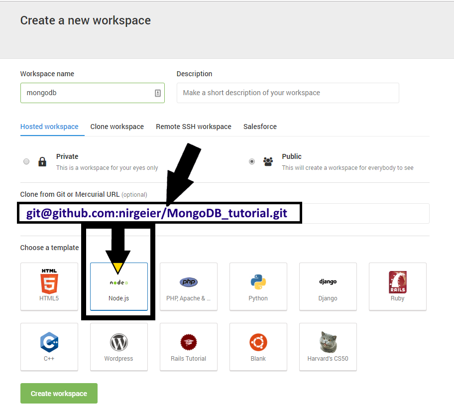
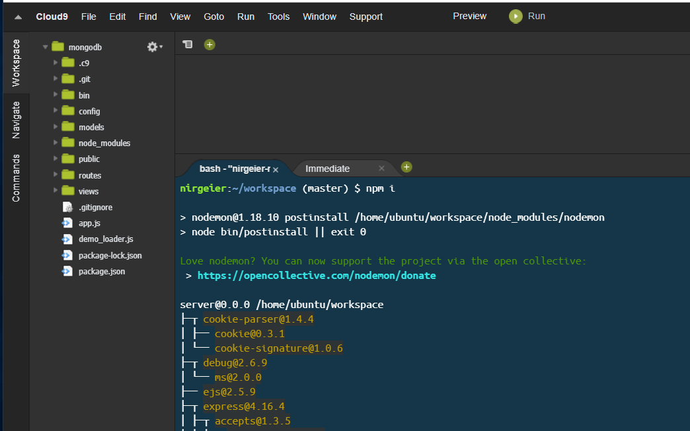

MongoDB Tutorial
----------------

In this tutorial we will cover the basics of MongoDB

### Pre-requirements

* NodeJS
* MongoDB

In case you dont have access to mongodb you can use any cloud service like
* [Cloud9](https://c9.io/login)

###  Using cloud 9
* Create account
* Create new project 
  - Fill in the url from this git repository
  - Choose NodeJs as template

    

* Once the project is opened you need to install the following:
      
  ```sh
  # Simply execute the pre defined script 
  # Set the execution permissions and execute the script
  chmod 777 ./install_env.sh && ./install_env.sh
  
  ```
    
  
* Once installed (ignore the errors) start the mongo server. Open new Terminal (under Window > New Terminal)
  ```sh

  # start the server in new terminal
  mongod

  ```